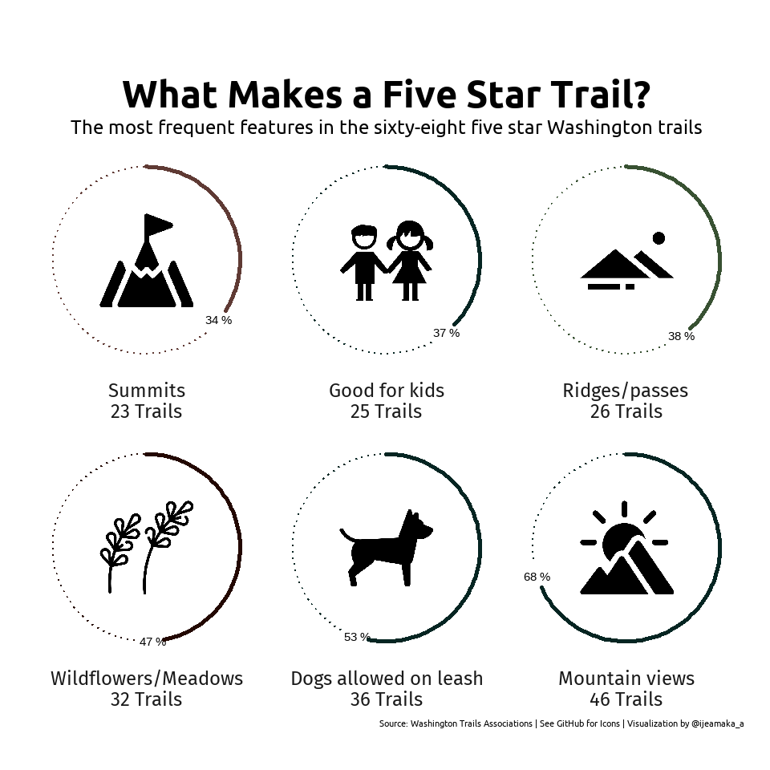

    library(tidyverse)

    ## -- Attaching packages --------------------------------------- tidyverse 1.3.0 --

    ## v ggplot2 3.3.2     v purrr   0.3.4
    ## v tibble  3.0.4     v dplyr   1.0.2
    ## v tidyr   1.1.2     v stringr 1.4.0
    ## v readr   1.4.0     v forcats 0.5.0

    ## -- Conflicts ------------------------------------------ tidyverse_conflicts() --
    ## x dplyr::filter() masks stats::filter()
    ## x dplyr::lag()    masks stats::lag()

    library(ggtext)
    library(ggimage)
    library(showtext)

    ## Loading required package: sysfonts

    ## Loading required package: showtextdb

    font_add_google(name = "Fira Sans", family = "fira")
    font_add_google(name = "Ubuntu", family = "Ubuntu")

    hike_data <- readr::read_rds(url('https://raw.githubusercontent.com/rfordatascience/tidytuesday/master/data/2020/2020-11-24/hike_data.rds'))

Filter the data for 5 star rating:

    top_hikes <- hike_data %>% 
      filter(rating == "5.00")

    img <- c(
      here::here("img", "washington_hikes", "dog.png"),
      here::here("img", "washington_hikes", "flower.png"),
      here::here("img", "washington_hikes", "kids.png"),
      here::here("img", "washington_hikes", "mountains.png"),
      here::here("img", "washington_hikes", "ridges.png"),
      here::here("img", "washington_hikes", "summits.png")
    )

    feature_split <- top_hikes %>% 
      select(features) %>% 
      unlist() %>% 
      unique()

    top_features <- feature_split %>% 
      map_df(function (x){
        data.frame(
          features = x,
          count = sum(str_detect(top_hikes$features, x))
        )
      }) %>% 
      as.tibble()

    top_list = list()
    for(i in 1:length(feature_split)){
      top_list[[i]] = sum(str_count(top_hikes$features, 
                          feature_split[i]))
    }

    ## Warning in stri_count_regex(string, pattern, opts_regex = opts(pattern)):
    ## argument is not an atomic vector; coercing

    ## Warning in stri_count_regex(string, pattern, opts_regex = opts(pattern)):
    ## argument is not an atomic vector; coercing

    ## Warning in stri_count_regex(string, pattern, opts_regex = opts(pattern)):
    ## argument is not an atomic vector; coercing

    ## Warning in stri_count_regex(string, pattern, opts_regex = opts(pattern)):
    ## argument is not an atomic vector; coercing

    ## Warning in stri_count_regex(string, pattern, opts_regex = opts(pattern)):
    ## argument is not an atomic vector; coercing

    ## Warning in stri_count_regex(string, pattern, opts_regex = opts(pattern)):
    ## argument is not an atomic vector; coercing

    ## Warning in stri_count_regex(string, pattern, opts_regex = opts(pattern)):
    ## argument is not an atomic vector; coercing

    ## Warning in stri_count_regex(string, pattern, opts_regex = opts(pattern)):
    ## argument is not an atomic vector; coercing

    ## Warning in stri_count_regex(string, pattern, opts_regex = opts(pattern)):
    ## argument is not an atomic vector; coercing

    ## Warning in stri_count_regex(string, pattern, opts_regex = opts(pattern)):
    ## argument is not an atomic vector; coercing

    ## Warning in stri_count_regex(string, pattern, opts_regex = opts(pattern)):
    ## argument is not an atomic vector; coercing

    ## Warning in stri_count_regex(string, pattern, opts_regex = opts(pattern)):
    ## argument is not an atomic vector; coercing

    ## Warning in stri_count_regex(string, pattern, opts_regex = opts(pattern)):
    ## argument is not an atomic vector; coercing

    ## Warning in stri_count_regex(string, pattern, opts_regex = opts(pattern)):
    ## argument is not an atomic vector; coercing

    ## Warning in stri_count_regex(string, pattern, opts_regex = opts(pattern)):
    ## argument is not an atomic vector; coercing

    names(top_list) = feature_split

    df_top_list = t(data.frame(top_list)) %>%
      as_tibble() %>%
      mutate(feature_name = row.names(.),
             feature_name_clean = feature_split,
             count = as.numeric(top_list),
             percentage = round(count / 68 * 100, 0)) %>%
      arrange(-count) %>%
      slice(1:6) %>%
      select(feature_name_clean, count, percentage) %>%
      mutate(images = c(img[4], img[1], img[2],
                        img[5], img[3], img[6]),
             label_name = paste0(feature_name_clean, "\n", count, " Trails"))

    ## Warning: The `x` argument of `as_tibble.matrix()` must have unique column names if `.name_repair` is omitted as of tibble 2.0.0.
    ## Using compatibility `.name_repair`.
    ## This warning is displayed once every 8 hours.
    ## Call `lifecycle::last_warnings()` to see where this warning was generated.

    df_top_list$label_name = forcats::fct_reorder(df_top_list$label_name, df_top_list$percentage)

    df_top_features <- top_features %>% 
      mutate(percentage = round((count / 68) * 100),
             label = paste0(features, "\n", count," Trails")) %>% 
      arrange(-count) %>% 
      slice(1:6) %>% 
      mutate(images = c(img[4], img[1], img[2],
                        img[5], img[3], img[6])) 
    df_top_features$label <- forcats::fct_reorder(df_top_features$label, df_top_features$percentage)

    showtext_auto()
    ggplot(df_top_features) + 
        geom_image(aes(x = 0,
                       y = 50,
                       image = images),
                   size = .4) +
        geom_text(
          aes(x = percentage + 2,
          y = 100,
          label = paste(percentage, "%")),
          size = 4
        ) +
        geom_segment(aes(
          x = percentage + 5,
          xend = 100,
          y = 100,
          yend = 100,
          color = features
      ),
      linetype = "dotted",
      linejoin = "mitre",
      size = .8) +
      geom_segment(aes(
        x = 0,
        xend = percentage,
        y = 100,
        yend = 100,
        color = features
      ),
      size = 2,
      lineend = "round") +
      facet_wrap(~label,
                 strip.position = "bottom") +
      coord_polar() +
      scale_color_manual(
        values = c("#052522", "#052522", 
                   "#052522", "#385132", 
                   "#5f3a34", "#230801")) +
      labs(
        title = "\nWhat Makes a Five Star Trail?",
        subtitle = "The most frequent features in the sixty-eight five star Washington trails",
        caption = paste0("Source: Washington Trails Associations | See GitHub for Icons | Visualization by @ijeamaka_a")
      ) +
      theme_classic() +
      theme(
        strip.background = element_blank(),
        axis.ticks = element_line(linetype = "blank"), 
        legend.position = "none",
        axis.text = element_blank(),
        axis.line = element_blank(),
        axis.title = element_blank(),
        strip.text = element_text(family = "fira",
                                  size = 18),
        plot.title = element_text(family = "Ubuntu", 
                                      face = "bold",
                                      size = 35, 
                                      hjust = 0.5),
        plot.subtitle = element_text(family = "Ubuntu", 
                                         size = 18,
                                         hjust = 0.5),
        plot.caption = element_text(family = "Ubuntu", 
                                        size = 8),
        plot.margin = margin(25, 25, 25, 25) 
        
      )

    ggsave(filename = "5.pdf",
           path = here::here("output"),
           plot = last_plot(),
           width = 10, height = 10)
